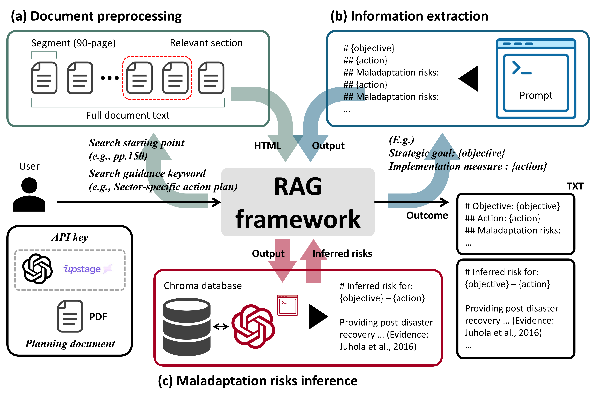

# Python codes and LLM prompts 

- This repository provides the Python code for the analysis (_RAG.py_) and evidence database construction (_Chroma.py_) to support reproducibility
- It also provides prompts, queries, output examples, and documentation on operational workflow.

## A. Technical setup and configuration 

- This section describes the system requirements, environment setup, directory structure, and model parameters required to reproduce the RAG pipeline used in this study.

### A.1. Required python libraries

- The pipeline uses the following key libraries: 

  - `openai` — LLM invocation (GPT-5-mini)
  - `requests` — Upstage Document Parse API call
  - `langchain_community.vectorstores.Chroma` — ChromaDB client
  - `langchain_community.embeddings.HuggingFaceEmbeddings` — Qwen3 embedding model
  - `sentence-transformers` — Qwen3 reranker and embedding backend
  - `PyPDF2` — PDF splitting and handling
  - `pathlib` — file management
  - `re` — regular expression parsing

- Recommended installation:

```bash
pip install openai langchain-community chromadb sentence-transformers PyPDF2 requests
```

### A.2. Directory structure

- The pipeline uses the following directory structure:

```bash
BASE/
│── CCAP_Action_Plan/        # Original PDFs (local government plans)
│── ChromaDB/                # Pre-built vector store persisted by Chroma
│── Output/                  # LLM outputs: extracted text, HTML, inference results
│── RAG.py                   # Main pipeline script
```

- In the script:

```python
BASE = Path(r"C:\path\to\your\project")
PDF_DIR = BASE / "CCAP_Action_Plan"
OUT_DIR = BASE / "Output"
CHROMA_DIR = BASE / "ChromaDB"
OUT_DIR.mkdir(parents=True, exist_ok=True)
```

### A.3. API keys and model configuration

- Set the following variables in the script to your own API keys before running the code:

  - `UPSTAGE_API_KEY`
  - `OPENAI_API_KEY`

- The pipeline uses the following models:

| Component | Model identifier |
|---|---|
| Document parsing | `document-parse-260930` (Upstage) |
| LLM | `gpt-5-mini-2025-08-07` (OpenAI) |
| Embedding | `Qwen/Qwen3-Embedding-0.6B` |
| Reranking | `Qwen/Qwen3-Reranker-0.6B` |

- All LLM calls used the same GPT-5-mini snapshot (`gpt-5-mini-2025-08-07`) with reasoning effort set to `medium`.
- The code explicitly specifies this setting in both the information extraction and plausible maladaptation risk inference calls:

```python
reasoning={"effort": "medium"}
```

- No explicit output token limit (`max_output_tokens`) was set.
- For plausible maladaptation risk inference, the prompt instructed the model to return a single concise paragraph.

- The pipeline uses `Qwen/Qwen3-Embedding-0.6B` for embedding and `Qwen/Qwen3-Reranker-0.6B` for reranking; both models support input sequences of up to 32,768 tokens.
- The longest cleaned article in the evidence corpus contained 24,442 tokens when tokenized with the Qwen tokenizer; therefore, no article-level truncation was required during embedding.

### A.4. Evidence database construction

- The _Chroma.py_ script provides the code used to construct the Chroma evidence database.
- The bibliographic list of articles included in the corpus is provided in Table S14 of the Supplementary Materials.

- The Chroma database is not publicly distributed because it contains article body texts, including those from non-open-access publications.

- To construct the database locally, obtain authorized copies of the articles listed in Table S14 and configure the following directories:

| Variable | Description |
| --- | --- |
| `PDF_DIR` | Directory containing the article PDFs |
| `OUT_DIR` | Directory for extracted HTML, cleaned Markdown, and bibliographic metadata |
| `INDEX_DIR` | Directory for the persistent Chroma database |

- Example configuration:

```python
PDF_DIR = Path(r"C:\path\to\articles")
OUT_DIR = Path(r"C:\path\to\processed_articles")
INDEX_DIR = Path(r"C:\path\to\ChromaDB")
```

- The construction script parses the PDFs, extracts bibliographic metadata, cleans the article body texts, and stores the texts and their embeddings in Chroma.
- Each article is embedded as a single document using `Qwen/Qwen3-Embedding-0.6B`.
- After database construction, set `CHROMA_DIR` in the main inference script (_RAG.py_) to the same directory as `INDEX_DIR`.

## B. Prompt and query
### B.1. Article body text cleaning

- The prompt below is provided in the `clean_with_gpt()` function in _Chroma.py_.

```text
# The following is raw text extracted from a PDF-formatted academic article.

# Your task is to extract and clean only the *main body text* from an academic article in plain text format.
# The goal is to remove all non-body elements while keeping the sentences of the main text exactly as written.

# Rules
## 1. Do not summarize, rephrase, or paraphrase; Keep the sentences exactly as in the original text.
## 2. Keep only the main body:
### Start after the "Introduction" or equivalent main section heading.
### If no explicit "Introduction" or similar heading exists, begin from the first narrative or analytical paragraph that follows the Abstract or Keywords
### Stop before any of the back matter sections as follows: References, Bibliography, Appendix, Acknowledgements, Author Contributions, Supplementary Information, or similar sections.
## 3. Remove these elements entirely:
### Tables, figures, graphs, and their captions (including text blocks beginning with "Table", "Figure", "Fig.", "Tab.". "Graph").
### Headers, footers, watermarks, footnotes, and page numbers.
### All citation references such as (Smith, 2020), [1], [12,13], etc.
## 4. Clean up formatting:
### Normalize spacing, remove excessive line breaks.
### Structure the text with Markdown headings (##, ###, ####: Section Title, and paragraphs).

# Output only the cleaned Markdown text.

Text:
{text}
```

### B.2. Information extraction 

- The prompt below is provided in the `ask_llm_on_document()` function in _RAG.py_.

```text
# Extract the text exactly as written in the document. Do not paraphrase, rewrite, or modify wording.
# Do not infer, assume, or supplement any information that is not explicitly stated in the document.
# Exclude all labels, numbering, bracketed codes, and formatting markers from outputs; return only the descriptive text.
        
# Objective/Action classification rules:       
## Only the sections in the document’s tables or main text that are explicitly marked as “추진전략” should be identified as {{objective}}.
## Only the sections in the document’s tables or main text that are explicitly marked as “실천과제” should be identified as {{action}}.
## Only structural labels (e.g., 추진전략, 실천과제) determine classification; Do not classify objectives and actions based on semantic meaning, wording style, and phrasing.
        
# Maladaptation definition: 
## Maladaptation arises from unintended trade-offs created by implementing an action to achieve its objective—such as harms imposed on other policy goals, social groups, or spatial areas.
## Do not classify background problems, general negative conditions, or implementation challenges (e.g., costs, burdens, resource shortages) as maladaptation.
## Do not infer maladaptation unless explicitly stated; if no maladaptation is explicitly mentioned for an action, output “(Missing)”.
        
# Extract maladaptation risks only for each {{action}} in relation to its corresponding {{objective}}.
# Attach maladaptation output under each action, but treat maladaptation as occurring at the objective–action pair level.
        
Output Format (must follow this structure strictly):
# Objective: {{objective}}
## Action: {{action}}
## Maladaptation risks: ...

Output Structure Rules:
# Output each objective–action pair as a separate block.
# Each block must contain exactly one Objective, one Action, and one Maladaptation risks field.
# If multiple actions correspond to the same objective, create a separate block for each action and repeat the identical objective text in every block.
# Do not list multiple actions under a single Objective heading.
# Repeat this block for all objective–action pairs.
        
=== DOCUMENT START ===
{document_text}
=== DOCUMENT END ===
```
### B.3. Retrieval query 

- The following predefined retrieval query template is used in the `infer_missing_impacts()` function in _RAG.py_.

```text
Maladaptation from implementing '{objective}' via measure '{action}'.
```

### B.4. Inference 

- The prompt below is provided in the `infer_missing_impacts()` function in _RAG.py_.

```text
# Your task is to infer maladaptation risks that may arise when achieving the given {objective} through its {action}.

# Maladaptation definition: 
## Maladaptation arises from unintended trade-offs created by implementing an action to achieve its objective—such as harms imposed on other policy goals, social groups, or spatial areas.
## Do not classify background problems, general negative conditions, or implementation challenges (e.g., costs, burdens, resource shortages) as maladaptation.
                 
# Using only the contextual evidence provided below, infer maladaptation risks for each objective–action pair.
# If no evidence supports a maladaptation risk, write: "(No evidence-based maladaptation found)"
                 
---
Objective: {objective}
                    
Action: {action}

Contextual Evidence: {context_text}
---
                 
# Instructions:
## 1. Write ONE concise paragraph describing an evidence-supported maladaptation.
## 2. Cite supporting evidence using its exact ID in square brackets, e.g., [E1] or [E1] [E2].
## 3. Only cite evidence IDs provided in Contextual Evidence.
## 4. Do not write author-year citations yourself; these will be added programmatically.                     
## 5. If no evidence supports a maladaptation risk, output only: "(No evidence-based maladaptation found)"
## 6. Respond in English.
                        
Output Format (must follow this structure strictly):
# Inferred risk for: {objective} – {action}
[Paragraph OR (No evidence-based maladaptation found)]
```

## C. Output
### C.1. Output format instruction in prompt

- In this study, we instructed the model (prompt) to produce a hierarchical output structure as follows.
- Information extraction:

```text
Output Format (must follow this structure strictly):
# Objective: {objective}
## Action: {action}
## Maladaptation risks: ...

(Repeat this block for all objective–action pairs)
```

- Inference:

```text
Output Format (must follow this structure strictly):
# Inferred risk for: {objective} – {action}
[Paragraph OR (No evidence-based maladaptation found)]
```

### C.2. Output example: Geumjeong-gu, Busan

- The full results for the Geumjeong-gu, Busan case presented in Section Results are shown below.
- This example illustrates the output structure generated by the pipeline.
- In the "Extraction:" and "Inference:" examples below, the text in parentheses beginning with "ENG=" is not part of the original output but the authors’ English translation provided for readers who do not read Korean.
- Extraction: 

```text
# Objective: 기후변화로부터 구민 건강 보호 (ENG = Protecting public health from climate change)
## Action: 취약계층 중심 건강관리 강화 (ENG = Strengthening health management for vulnerable population groups)
## Maladaptation risks: (Missing)

# Objective: 기후변화로부터 구민 건강 보호 (ENG = Protecting public health from climate change)
## Action: 감염병 예방 및 신속 대응체계 강화 (ENG = Strengthening the prevention and rapid response system for infectious diseases)
## Maladaptation risks: (Missing)

# Objective: 구민 안전 확보 및 피해 최소화 (ENG = Ensuring public safety and minimizing climate-related risks)
## Action: 폭염으로부터 안전한 생활환경 조성 (ENG = Creating a heat-resilient community environment)
## Maladaptation risks: (Missing)

# Objective: 구민 안전 확보 및 피해 최소화 (ENG = Ensuring public safety and minimizing climate-related risks)
## Action: 체계적 풍수해 대응 관리 (ENG = Systematic management and response to storm and flood damage)
## Maladaptation risks: (Missing)

# Objective: 구민 안전 확보 및 피해 최소화 (ENG = Ensuring public safety and minimizing climate-related risks)
## Action: 미세먼지 대응 강화 (ENG = Enhancing particulate matter mitigation)
## Maladaptation risks: (Missing)

# Objective: 재해로부터 안전한 산림환경 구축 (ENG = Building a safe forest environment protected from disasters)
## Action: 산림종합방제 시스템 구축 (ENG = Establishing an integrated forest control system)
## Maladaptation risks: (Missing)

# Objective: 재해로부터 안전한 산림환경 구축 (ENG = Building a safe forest environment protected from disasters)
## Action: 기후변화 적응을 위한 산림 확대 (ENG = Expanding forest cover for climate change adaptation)
## Maladaptation risks: (Missing)

# Objective: 안정적 물이용 체계 확보 (ENG = Establishing a stable usage framework)
## Action: 안전한 물 공급 및 깨끗한 수자원 관리 (ENG = Ensuring a stable water supply and clean water resource management)
## Maladaptation risks: (Missing)

# Objective: 기후변화 대응 역량 강화 (ENG = Strengthening capacities for climate change response)
## Action: 저탄소 생활 실천 활성화 (ENG = Promoting the practice of low-carbon lifestyles)
## Maladaptation risks: (Missing)
```

- Inference: 

```text
# Inferred risk for: 기후변화로부터 구민 건강 보호 – 취약계층 중심 건강관리 강화 (ENG = Protecting public health from climate change - Strengthening health management for vulnerable population groups)
Focusing health interventions on vulnerable groups via strengthened, centralized/formal services risks creating dependence on infrastructure that can be more fragile in extreme events (e.g., households relying on piped/formal water experienced greater disruption than those using decentralized informal sources after Cyclone Idai), and if such targeting or service changes are delivered in a top‑down, non‑participatory way they can provoke mistrust, social contestation, economic harms and perceived marginalization that undermine uptake and equity of health measures (Evidence: McCordic et al., 2024; Bonati, 2022).

# Inferred risk for: 기후변화로부터 구민 건강 보호 – 감염병 예방 및 신속 대응체계 강화 (ENG = Protecting public health from climate change - Strengthening the prevention and rapid response system for infectious diseases)
Strengthening infectious-disease prevention and rapid-response through centralized, technocratic measures risks creating maladaptation by deepening distrust and marginalization (reducing community cooperation and unevenly distributing protections), because top‑down emergency interventions that ignore local social/economic contexts provoke contestation and can undermine effectiveness; moreover, reliance on formalized, centralized systems can be more fragile and overlook informal/local coping strategies, and failure to integrate social and climate-sensitive needs (e.g., cooling for heat-exposed, unequipped housing) can produce insufficient adaptation and increased health harms for vulnerable groups (Evidence: Bonati, 2022; McCordic et al., 2024; Hosseini et al., 2022).

# Inferred risk for: 구민 안전 확보 및 피해 최소화 – 폭염으로부터 안전한 생활환경 조성 (ENG = Ensuring public safety and minimizing climate-related risks - Creating a heat-resilient community environment)
Implementing standardized, techno‑managerial “heat‑safe” measures (e.g., marketized cooling technologies, infrastructure or productivity‑focused interventions framed as resilience) risks privileging better‑connected, male and central households while excluding downstream, peripheral, women and the food‑insecure—because such resilience approaches can be depoliticize needs, be captured by elites, and prioritize neoliberal market solutions over locally prioritized needs—leading to unequal benefit distribution and possibly increased vulnerability among marginalized groups who are also more risk‑averse and less likely to adopt or access such interventions; this is exacerbated where one‑size‑fits‑all measures replace locally tailored, agroecosystem‑sensitive solutions (Evidence: Mikulewicz, 2019; Bro, 2020; Adego, 2021).

# Inferred risk for: 구민 안전 확보 및 피해 최소화 – 체계적 풍수해 대응 관리 (ENG = Ensuring public safety and minimizing climate-related risks - Systematic management and response to storm and flood damage)
Systematic, top‑down flood/wind‑hazard management can unintentionally erode local adaptive capacity and social institutions by sidelining indigenous ecological knowledge and hands‑on community practices, creating dependency and elite/NGO capture of resources; it can also drive land acquisition or standardized infrastructure that undermines tenure security and discourages labour‑intensive, place‑based investments (reducing practices like zaï), disproportionately harming marginalized groups (e.g., women) and producing maladaptive spatial and equity outcomes when one‑size‑fits‑all measures are imposed (Evidence: Palframan, 2014; Nyantakyi-Frimpong, 2020; Adego, 2021).

# Inferred risk for: 구민 안전 확보 및 피해 최소화 – 미세먼지 대응 강화 (ENG = Ensuring public safety and minimizing climate-related risks - Enhancing particulate matter mitigation)
Strengthening responses to fine particulate pollution that rely on encouraging indoor sheltering, widespread air-conditioning/centralized filtration, or technical/relocation fixes can produce maladaptive trade-offs: increased AC use and waste heat can exacerbate urban heat–island effects and heat-related morbidity (disproportionately harming vulnerable groups who lack effective cooling), reduce outdoor livelihoods/productivity, and deepen climate justice issues; interventions that depend on centralized infrastructure or on relocating/redistributing sources or populations risk displacing hazards onto marginalized communities, provoking resistance, and creating uneven, politically fraught outcomes or infrastructural fragility during other shocks (e.g., post-disaster service disruptions), thereby undermining broader safety and equity goals (Evidence: He et al., 2022; Sarmiento, 2020; McCordic et al., 2024).

# Inferred risk for: 재해로부터 안전한 산림환경 구축 – 산림종합방제 시스템 구축 (ENG = Building a safe forest environment protected from disasters - Establishing an integrated forest control system)
A centralized, technocratic forest protection system could create maladaptive trade‑offs by reinforcing exclusion and spatial inequality—prioritizing large, financialized, top‑down interventions that neglect or exclude marginalized groups (e.g., non‑citizen workers and the Bidoon) and elite/urban areas while leaving informal or low‑income communities underprotected; by enabling or justifying state land control or large‑scale acquisitions that undermine tenure security and disincentivize local stewardship and labour‑intensive agroecological practices; and by depending on centralized infrastructure that may be more fragile in extreme events, thereby producing uneven protection and greater long‑term vulnerability for marginalized populations and places (Evidence: Sharp et al., 2024; Nyantakyi-Frimpong, 2020; McCordic et al., 2024).

# Inferred risk for: 재해로부터 안전한 산림환경 구축 – 기후변화 적응을 위한 산림 확대 (ENG = Building a safe forest environment protected from disasters - Expanding forest cover for climate change adaptation)
Expanding forests as a climate-adaptation measure can produce maladaptive social and spatial trade-offs: improved local environment and reduced heat may raise property values and living costs, drive displacement of low-income or heat-vulnerable residents (so they do not benefit from the cooling), and concentrate green benefits among wealthier newcomers rather than surrounding communities, while benefits may not spill over to adjacent areas; additionally, focusing on greening without integrated planning can worsen equity in access to resources (including affordable healthy food) across socio-economic groups—turning ecological gains into drivers of “green/climate gentrification” and unequal outcomes (Evidence: Li et al., 2023; Yazar et al., 2023; James and Friel, 2015).

# Inferred risk for: 안정적 물이용 체계 확보 – 안전한 물 공급 및 깨끗한 수자원 관리 (ENG = Establishing a stable usage framework - Ensuring stable water supply and clean water resource management)
Implementing safe water supply and clean water management via centralized, performance‑driven, techno‑managerial infrastructure risks maladaptation by channeling resources to politically and economically prioritized areas (creating protected “winners”) while leaving dense, low‑income, hazard‑exposed neighborhoods under‑protected, legitimizing short‑term growth over long‑term resilience, locking in hard infrastructure that may be inadequate for future climate stresses (e.g., tidal-gate designs based on past events), and reproducing uneven vulnerabilities; additionally, formalizing responsibility with authorities can suppress local engagement and preference for locally appropriate or nature‑based solutions, undermining maintenance, community support, and adaptive capacity, thereby producing unintended harms to water security and equity (Evidence: Lo et al., 2024; Mikulewicz, 2019; Adloff and Rehdanz, 2024).

# Inferred risk for: 기후변화 대응 역량 강화 – 저탄소 생활 실천 활성화 (ENG = Strengthening capacities for climate change response - Promoting the practice of low-carbon lifestyles)
Promoting low‑carbon lifestyles without accounting for extreme heat and local resource limits can backfire: energy‑saving or reduced cooling measures may produce indoor overheating and health risks under future extreme warm events (i.e., insufficient cooling/natural ventilation becomes maladaptive), while rapid deployment of low‑carbon supply options (e.g., geothermal) to support low‑carbon living can cause unsustainable groundwater abstraction, loss of surface thermal features, damage to sacred sites and tourism revenue, and thus undermine local adaptive capacity and livelihoods if water and environmental impacts are not controlled (Evidence: Hosseini et al., 2022; Ogola et al., 2012).
```

- Retrieval and reranking results are stored as JSON files for each objective–action pair.
- An example of the JSON structure is shown below.

```text
{
  "objective": "구민 안전 확보 및 피해 최소화",
  "action": "폭염으로부터 안전한 생활환경 조성",
  "query": "Maladaptation from implementing '구민 안전 확보 및 피해 최소화' via measure '폭염으로부터 안전한 생활환경 조성'.",
  "evidence": [
    {
      "evidence_id": "E1",
      "retrieval_rank": 5,
      "rerank_rank": 1,
      "rerank_score": -3.1875,
      "selected_for_llm": true,
      "citation": "Mikulewicz, 2019",
      "metadata": {
        "title": "Thwarting adaptation’s potential? A critique of resilience and climate-resilient development",
        "year": "2019",
        "doi": "10.1016/j.geoforum.2019.05.010",
        "source": "C:\\Users\\RDPL-005\\Desktop\\Included\\Mikulewicz (2019).pdf",
        "authors": "Michael Mikulewicz",
        "journal": "Geoforum"
      },
      "passage": "[omitted from public example]"
   },

...
```

- Each record includes the objective, action, retrieval query, and retrieved evidence documents.
- For each document, it reports the evidence ID, original retrieval rank, reranking rank and score, selection status for LLM input, and bibliographic metadata.
- Article text in the `passage` field is omitted from the example shown here to avoid redistributing copyrighted content.

## D. Operational workflow: End-user configuration 
### D.1. Summary

<p align="center">
  
</p>

<p align="center">
  <b>Figure S1.</b> Model operation workflow for end users.
</p>

This section explains the operation of the proposed planning support model from an end-user perspective. To run the model, users must prepare the target planning document (PDF), have access to API keys for Upstage Document Parse and OpenAI (GPT), and have a locally constructed Chroma evidence database. The overall operational flow comprises three stages: (1) document input and preprocessing, (2) structured information extraction, and (3) evidence-based inference of plausible maladaptation risks. This section outlines the general workflow of these procedures. 

First, the user provides the target plan as a PDF and specifies the page from which section searching should begin, together with the keywords marking the beginning and end of the relevant section. As the parser cannot process documents exceeding 100 pages, the identified section is divided into segments of up to 90 pages when necessary (Figure S1(a)). Each segment is converted separately into HTML using Upstage Document Parse, and the resulting HTML files are subsequently merged into a single document. Once these document-specific parameters are specified, the subsequent extraction process proceeds automatically. 

Using the converted file, the model invokes the LLM with a predefined prompt (Figure S1(b)). The prompt instructs the model to classify specific expressions in the document as objectives or actions, consistent with the terminology used in the target planning document (e.g., 실천과제 → action). It also prohibits the model from rewriting the content present in the document and inferring information that is not explicitly stated. For each objective–action pair, the model assesses whether the plan explicitly considers plausible maladaptation risks. If no such consideration is identified, the model outputs “(Missing)” for the corresponding pair. Here, “explicit consideration” does not require the term “maladaptation” to appear in the plan. It refers to whether the plan explicitly describes an unexpected side effect or adverse consequences that may arise from implementing the action. 

When plausible maladaptation risks are not identified in the planning document, the pipeline proceeds to an evidence-based inference module that leverages an external knowledge base (Figure S1(c)). For each objective–action pair, the model constructs a retrieval query using a predefined template (see Section B.3), retrieves the five most relevant articles from a Chroma vector database using Qwen3-Embedding-0.6B (_k_ = 5), and reranks these articles using Qwen3-Reranker-0.6B. The three highest-ranked articles are then supplied to the LLM as contextual evidence (_k_ = 3).<sup>1</sup> Based only on the selected evidence, the LLM generates a concise paragraph describing a plausible maladaptation risk and cites the supporting evidence used in the inference.

1) _k_ values are pragmatic settings to limit computational cost and are not theoretically fixed; they can be adjusted by corpus size and analytical objectives. 

### D.2. Section extraction parameters
- Users must know beforehand which page the search should start from and which keywords appear in the document. 
- The model begins scanning after the specified page and extracts the section once the keyword is detected, meaning that some prior knowledge is required.
- Used for target-section retrieval:

```python
min_page_threshold = 150
```

- Korean keywords: 

```python
start_kw = "부문별세부시행계획"
end_kw   = "계획의집행및관리"
```

- When the planning document changes, the keywords and the search starting point must be adjusted manually.

### D.3. Objective–action label configuration
- The labels that correspond to {objective} and {action} must be specified for each document.
- In this study, the prompt explicitly specified which keywords in the document should be interpreted as {objective} and {action}:

```text
# Objective/Action classification rules:       
## Only the sections in the document’s tables or main text that are explicitly marked as “추진전략” should be identified as {{objective}}.
## Only the sections in the document’s tables or main text that are explicitly marked as “실천과제” should be identified as {{action}}.
## Only structural labels (e.g., 추진전략, 실천과제) determine classification; Do not classify objectives and actions based on semantic meaning, wording style, and phrasing.
```
- Because local governments may use different labels for equivalent hierarchical levels, the objective and action labels were adjusted as needed to match the terminology used in each document.
